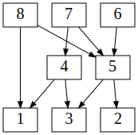
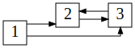

# md.python.graph
## Overview

md.python.graph component defines contracts to perform operations over
graph type, and provides few useful tools out from box.

## Architecture overview

[![Architecture overview][architecture-overview]][architecture-overview]

## Component overview

```python3
# Types
NodeType = typing.TypeVar('NodeType', bound=typing.Hashable)
GraphType = typing.Mapping[NodeType, typing.Collection[NodeType]]
GraphPathType = typing.Iterable[NodeType]
TopologicalSortType = typing.Callable[[GraphType], typing.Iterable[NodeType]]

# Implementation 
def topological_sort_ascending(graph: GraphType) -> typing.Iterable[NodeType]: ...

def topological_sort_descending(
    graph: GraphType,
    initial_node: typing.Iterable[NodeType] = None
) -> typing.Iterable[NodeType]: ...

def get_paths(graph: GraphType, include_subtree: bool = False) -> typing.Tuple[
    typing.List[GraphPathType],
    typing.List[GraphPathType],
]: ...
```

## Install

```sh
pip install md.python.graph --index-url https://source.md.land/python/
```

## Usage
### Graph topological sorting

Topological sorting function returns an iterator over the nodes of a directed graph, 
starting from the leaves and progressing towards the root.

Component provides two types of directed graph topological sorting: 

1. **ascending:** from the bottom to the top
2. **descending:** from the top to the bottom

Type of sorting does not affect the order of nodes in result of sorting,
but defines algorithm direction of nodes traversing. 

#### Ascending topological sorting

```python3
def topological_sort_ascending(graph: GraphType) -> typing.Iterable[NodeType]: ...
```

Ascending topological sorting performs sorting from the bottom to the top,
and raises an `TopologicalSortException` exception, if graph contains cycles.

**Example 1:** Directed *acyclic* graph with **ascending** topological sorting:



```python3
import md.python.graph

if __name__ == '__main__':
    print(
        list(
            md.python.graph.topological_sort_ascending(graph={
                7: {5, 4},
                5: {3, 2},
                8: {5, 1},
                6: {5},
                4: {3, 1},
            })
        )
    )
```

Will print:

```
[1, 2, 3, 4, 5, 6, 7, 8]
```

When graph has a cycle, `topological_sort_ascending` will raise an 
`TopologicalSortException` exception with `CYCLE_DETECTED` code.

**Example 2:** Directed *cyclic* graph with **ascending** topological sorting raises an exception:



```python3
import md.python.graph

if __name__ == '__main__':
    try:
        list(md.python.graph.topological_sort_ascending(graph={
            1: {2, 3},
            2: {3},
            3: {2},
        }))
    except md.python.graph.TopologicalSortException as e:
        assert e.code is md.python.graph.TopologicalSortException.CYCLE_DETECTED
        print(e.graph)  # {1: {2, 3}, 2: {3}, 3: {2}}
```

The raised exception contains a graph with only unsorted nodes in `graph` attribute, 
it could be used to expose graph path which has 
a cycle (see [get_path](#graph-paths-retrieval) below, for example).

#### Descending topological sorting

```python3
def topological_sort_descending(
    graph: GraphType,
    initial_node: typing.Iterable[NodeType] = None
) -> typing.Iterable[NodeType]: ...
```

Descending topological sorting performs sorting from the top to the bottom,
and **not** raises an exception, if the graph contains a cycle.

**Example 3:** Directed *acyclic* graph with **descending** topological sorting:


```python3
import md.python.graph

if __name__ == '__main__':
    print(
        list(
            md.python.graph.topological_sort_descending(graph={
                7: {5, 4},
                5: {3, 2},
                8: {5, 1},
                6: {5},
                4: {3, 1},
            })
        )
    )
```

Will print:

```
[1, 2, 3, 4, 5, 6, 7, 8]
```

When graph has a cycle, `topological_sort_descending` will not raise an exception:

**Example 4:** Directed *cyclic* graph with **descending** topological sorting:


```python3
import md.python.graph

if __name__ == '__main__':
    print(
        list(md.python.graph.topological_sort_descending(graph={
            1: {2, 3},
            2: {3},
            3: {2},
        }))
    )
```

Will print:

```
[3, 2, 1]
```

#### Contract and implementations

Component defines `TopologicalSortInterface` contract to perform topological sorting
and default implementation:

- `AscendingTopologicalSort` — calls underlying `topological_sort_ascending`
- `DescendingTopologicalSort` — calls underlying `topological_sort_descending`

### Graph paths retrieval

```python3
def get_paths(graph: GraphType, include_subtree: bool = False) -> typing.Tuple[
    typing.List[GraphPathType],
    typing.List[GraphPathType],
]: ...
```

`md.python.graph.get_paths` function performs path retrieval 
and returns two-sized tuple of lists:

1. list of paths without cycle
2. list of paths with cycle

Function takes optional `include_subtree: bool = False` argument and 
when it is `True` includes paths of subtrees in result.

This function uses underlying [topological_sort_descending](#descending-topological-sorting) 
function and safe for path retrieval on either cyclic or acyclic graph. 

**Example 5:** Directed *acyclic* graph path retrieval *without* subtrees paths (by default):


```python3
import md.python.graph

if __name__ == '__main__':
    print(
        list(
            md.python.graph.get_paths(
                graph={
                    7: {5, 4},
                    5: {3, 2},
                    8: {5, 1},
                    6: {5},
                    4: {3, 1},
                },
                include_subtree=False
            )
        )
    )
```

Will print:

```
[[[6, 5, 2], [6, 5, 3], [8, 1], [8, 5, 2], [8, 5, 3], [7, 4, 1], [7, 4, 3], [7, 5, 2], [7, 5, 3]], []]
```

**Example 6:** Directed *acyclic* graph path retrieval *with* subtrees paths:

```python3
import md.python.graph

if __name__ == '__main__':
    print(
        list(
            md.python.graph.get_paths(
                graph={
                    7: {5, 4},
                    5: {3, 2},
                    8: {5, 1},
                    6: {5},
                    4: {3, 1},
                },
                include_subtree=True
            )
        )
    )
```

Will print:

```
[[[4, 1], [4, 3], [5, 2], [5, 3], [7, 4, 1], [7, 4, 3], [7, 5, 2], [7, 5, 3], [8, 1], [8, 5, 2], [8, 5, 3], [6, 5, 2], [6, 5, 3]], []]
```

**Example 7:** Directed *cyclic* graph path retrieval *without* subtrees paths (by default):


without subtrees paths (by default):

```python3
import md.python.graph

if __name__ == '__main__':
    print(
        list(
            md.python.graph.get_paths(
                graph={
                    1: {2, 3},
                    2: {3},
                    3: {2},
                },
                include_subtree=False
            )
        )
    )
```

Will print:

```
[[[1, 3, 2]], [[2, 3, 2]]]
```

**Example 8:** Directed *cyclic* graph path retrieval *with* subtrees paths:

```python3
import md.python.graph

if __name__ == '__main__':
    print(
        list(
            md.python.graph.get_paths(
                graph={
                    7: {5, 4},
                    5: {3, 2},
                    8: {5, 1},
                    6: {5},
                    4: {3, 1},
                },
                include_subtree=True
            )
        )
    )
```

Will print:

```
[[[4, 1], [4, 3], [5, 2], [5, 3], [7, 4, 1], [7, 4, 3], [7, 5, 2], [7, 5, 3], [8, 1], [8, 5, 2], [8, 5, 3], [6, 5, 2], [6, 5, 3]], []]
```

#### Expose cyclic paths for ascending topological sort

Since `topological_sort_descending` does not raise an exception for cyclic graph,
it could be useful to expose cycle paths with [get_paths](#graph-paths-retrieval)
when [ascending topological sort](#ascending-topological-sorting) 
raised an exception, for example:
    
```python3
import md.python.graph

if __name__ == '__main__':
    try:
        list(md.python.graph.topological_sort_ascending(graph={
            1: {2, 3},
            2: {3},
            3: {2},
            4: {8},
            15: {16},
            23: {42}
        }))
    except md.python.graph.TopologicalSortException as e:
        assert e.code is md.python.graph.TopologicalSortException.CYCLE_DETECTED
        print(e.graph)  # {1: {2, 3}, 2: {3}, 3: {2}}
    
        _, cycle_path_list = md.python.graph.get_paths(graph=e.graph)
        print(cycle_path_list)  # [[2, 3, 2]]
```

[architecture-overview]: _static/architecture-overview.class-diagram.svg
